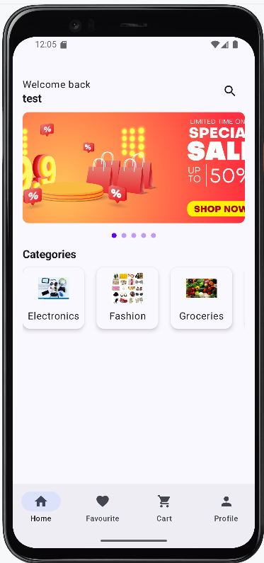
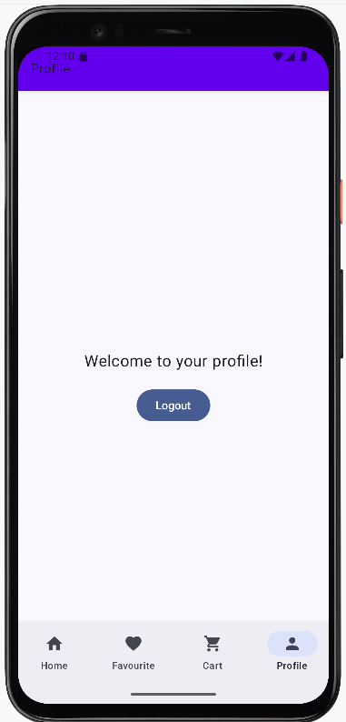

# 🛒 EasyShop - E-commerce Android App

**EasyShop** is a simple and clean e-commerce app built using **Jetpack Compose** and **Firebase**. It provides core shopping functionality such as login, product browsing by category, cart management, and order placement.

---

## ✨ Features

- 🔐 **User Authentication**
    - Register new users using email & password
    - Login and logout functionality with Firebase Auth

- 📦 **Product Display**
    - Fetch and display products from Firebase Firestore
    - Filter and view products by categories (e.g., Electronics, Fashion)

- 🛍️ **Shopping Cart**
    - Add items to cart
    - View and manage cart items (update or remove)
    - Prevent checkout if cart is empty

- 💳 **Order Placement**
    - Checkout with a summary of subtotal, tax, and discount
    - Store orders in Firestore with user info and order details
    - Automatically clear the cart after successful order placement

- 🧭 **Navigation**
    - Seamless screen navigation using Jetpack Navigation:
        - `LoginPage`
        - `RegisterPage`
        - `HomePage`
        - `CategoryPage`
        - `CartPage`
        - `CheckoutPage`

---

## 🔧 Tech Stack

- **Kotlin**
- **Jetpack Compose**
- **Firebase Auth** (for login/registration)
- **Firebase Firestore** (for data storage and real-time updates)
- **Jetpack Navigation** (for screen transitions)
- **State Management** using `remember`, `mutableStateOf`, `LaunchedEffect`

---

## 🧪 Screens & Flow

1. **Authentication**
    - User signs up or logs in using email & password

2. **Home Screen**
    - Displays list of product categories

3. **Category Screen**
    - Displays items under the selected category

4. **Cart**
    - Users can add/remove products from the cart
    - Total, discount, and tax are dynamically calculated

5. **Checkout**
    - Users confirm the order
    - Cart is cleared after successful order placement

6. **Navigation**
    - Smooth navigation handled with `NavController` and routes

---

## 📁 Project Structure (Highlights)
com.example.easyshop
├── components/ # Reusable UI components (e.g., CartItemView)
├── model/ # Data models (UserModel, ProductModel, OrderModel)
├── pages/ # All UI screens (LoginPage, HomePage, CartPage, etc.)
├── GlobalNavigation.kt # Navigation controller reference
├── AppUtil.kt # Utility functions (e.g., tax & discount)

1. Clone the repository:
   git clone https://github.com/PremmChand/EasyShop.git
   
2. Open the project in Android Studio.
3. Configure Firebase:
 ->Add your google-services.json in the app/ folder
 ->Set up Firebase Authentication and Firestore in the Firebase Console

## 📸 Screenshots

### 🚀 Initial Screen

### 🔐 Login Screen

### 📝 Register Screen

### 🏠 Home Screen

### 📦 Items Screen

### 🛒 Add to Cart Screen

### ➕➖ Add/Remove Screen

### 📦 Orders Screen

### 🔓 Logout Screen

